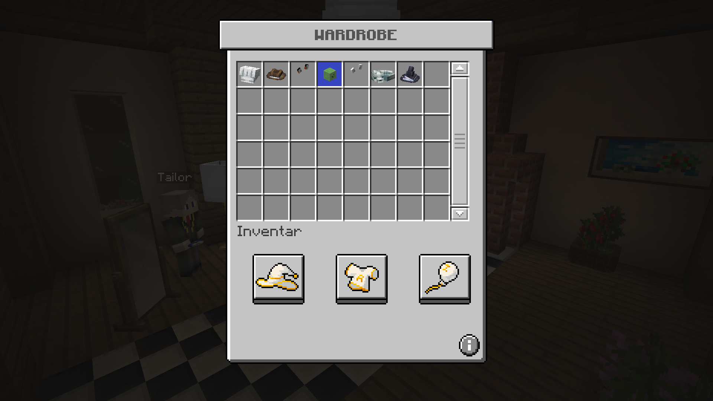
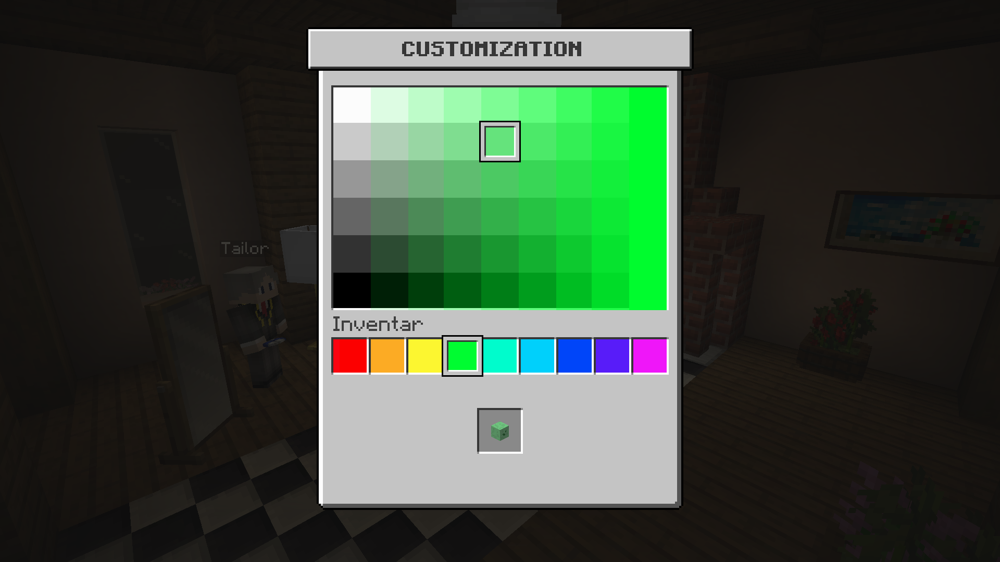

# CCVanilla UI

--8<-- "back.txt"

!!! stats "Statistics"
    :octicons-copilot-24: **Hat Items:** None  
    :octicons-person-24: **Body Items:** None  
    :octicons-rocket-24: **Balloon Items:** None
    
    :octicons-package-24: **Standalone version:** :octicons-check-24:{ .octicons-true }  
    :octicons-git-merge-24: **ItemsAdder version:** :octicons-check-24:{ .octicons-true }
    
    :octicons-mark-github-16: **Source Code:** https://github.com/Andre601/CCVanillaUI
    
    :octicons-download-24: **Download:** https://github.com/Andre601/CCVanillaUI/releases

This add-on doesn't add any cosmetics.  
Instead does it replace the GUIs and cursor icons of the plugin with more vanilla-like ones.

## Previews

{ align=left loading=lazy width="50%" }
{ align=left loading=lazy width="50%" }