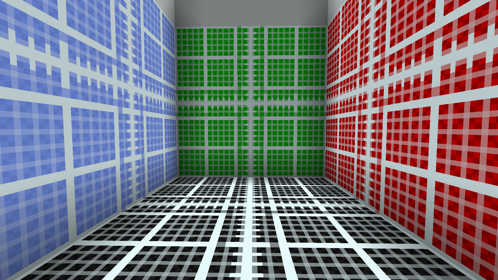
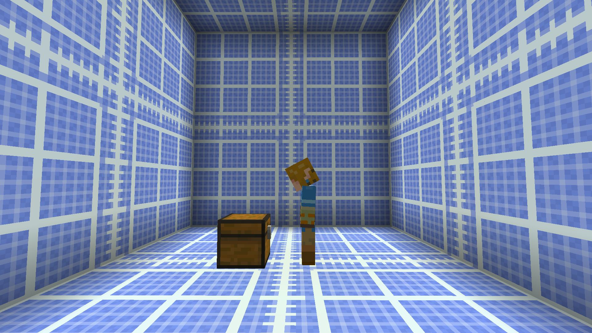

# Grid Blocks

--8<-- "back.txt"

!!! stats "Statistics"
    :octicons-package-24: **Blocks:** [16](#blocks)  
    :octicons-stack-24: **Items:** [17](#items)  
    :octicons-browser-24: **GUIs:** None
    
    :octicons-mark-github-16: **Source Code:** https://github.com/Andre601/GridBlocks
    
    :octicons-download-24: **Download:** https://github.com/Andre601/GridBlocks/releases/latest

GridBlocks adds some utility blocks with a grid-like texture. The goal of it is to help other add-on or resource pack creators to see how a new block, item, etc. could look like in terms of scale.

## Blocks

??? info "Show/Hide Blocks"
    - `gridblocks:black_grid`
    - `gridblocks:black_scale_horizontal_east_west`
    - `gridblocks:black_scale_horizontal_north_south`
    - `gridblocks:black_scale_vertical`
    - `gridblocks:blue_grid`
    - `gridblocks:blue_scale_horizontal_east_west`
    - `gridblocks:blue_scale_horizontal_north_south`
    - `gridblocks:blue_scale_vertical`
    - `gridblocks:green_grid`
    - `gridblocks:green_scale_horizontal_east_west`
    - `gridblocks:green_scale_horizontal_north_south`
    - `gridblocks:green_scale_vertical`
    - `gridblocks:red_grid`
    - `gridblocks:red_scale_horizontal_east_west`
    - `gridblocks:red_scale_horizontal_north_south`
    - `gridblocks:red_scale_vertical`

## Items

??? info "Show/Hide Items"
    - `gridblocks:black_grid_item`
    - `gridblocks:black_scale_center_item`
    - `gridblocks:black_scale_horizontal_item`
    - `gridblocks:black_scale_vertical_item`
    - `gridblocks:blue_grid_item`
    - `gridblocks:black_scale_center_item`
    - `gridblocks:black_scale_horizontal_item`
    - `gridblocks:black_scale_vertical_item`
    - `gridblocks:green_grid`
    - `gridblocks:black_scale_center_item`
    - `gridblocks:black_scale_horizontal_item`
    - `gridblocks:black_scale_vertical_item`
    - `gridblocks:red_grid`
    - `gridblocks:black_scale_center_item`
    - `gridblocks:black_scale_horizontal_item`
    - `gridblocks:black_scale_vertical_item`

## Previews

{ align=left loading=lazy width="50%" }
{ align=left loading=lazy width="50%" }
