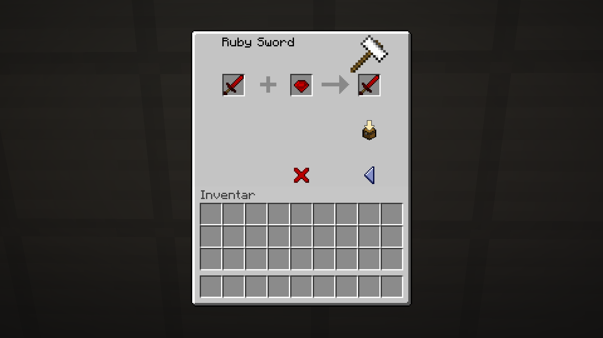
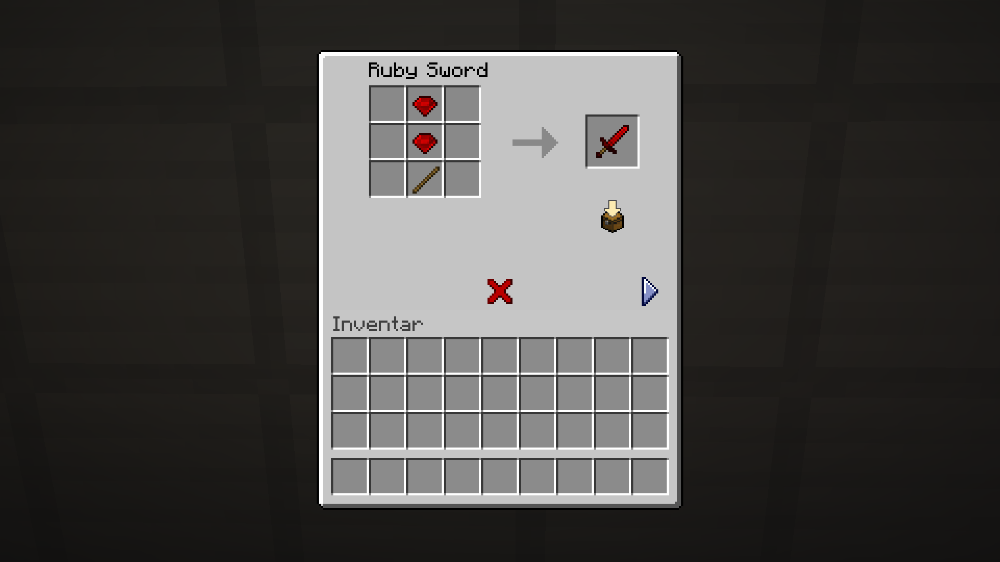
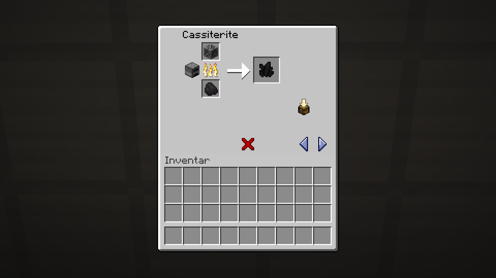
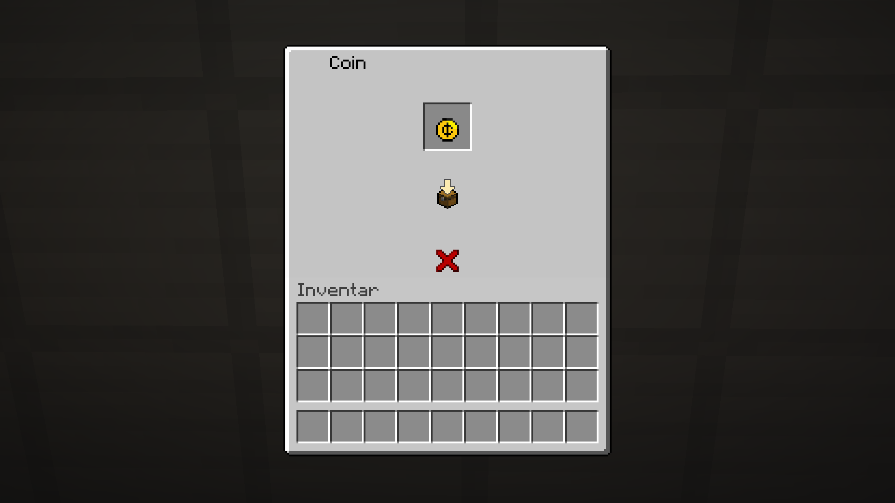

# IA Vanilla UI

--8<-- "back.txt"

!!! stats "Statistics"
    :octicons-package-24: **Blocks:** None  
    :octicons-stack-24: **Items:** None  
    :octicons-browser-24: **GUIs:** [6](#guis)
    
    :octicons-mark-github-16: **Source Code:** https://github.com/Andre601/IAVanillaUI
    
    :octicons-download-24: **Download:** https://www.spigotmc.org/resources/102783/

Replaces the `/ia` UIs with ones that mimic the vanilla GUI design.

## GUIs

??? info "Show/Hide GUIs"
    - `:anvil_repair:`
    - `:blank_menu:`
    - `:cooking:`
    - `:crafing:`
    - `:no_recipe:`
    - `:smithing:`

## Previews

{ align=left loading=lazy width="50%" }
{ align=left loading=lazy width="50%" }
{ align=left loading=lazy width="50%" }
{ align=left loading=lazy width="50%" }
